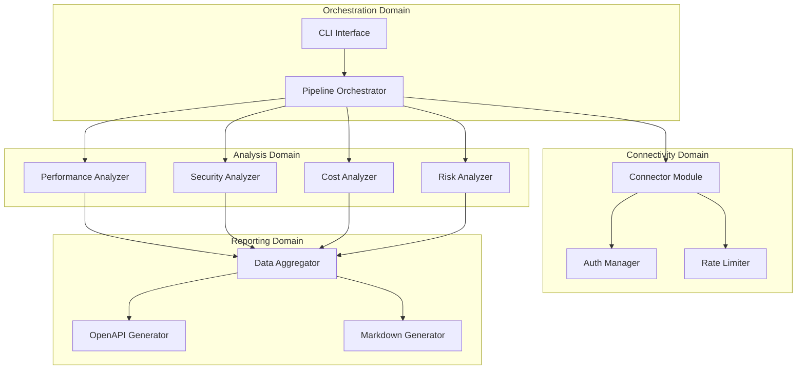
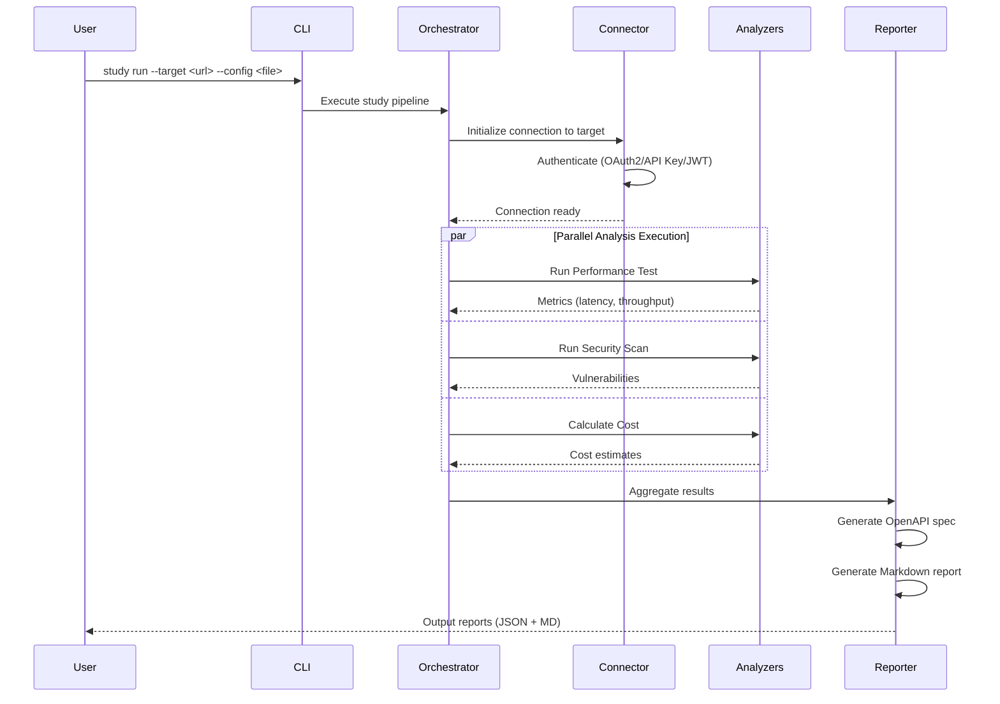
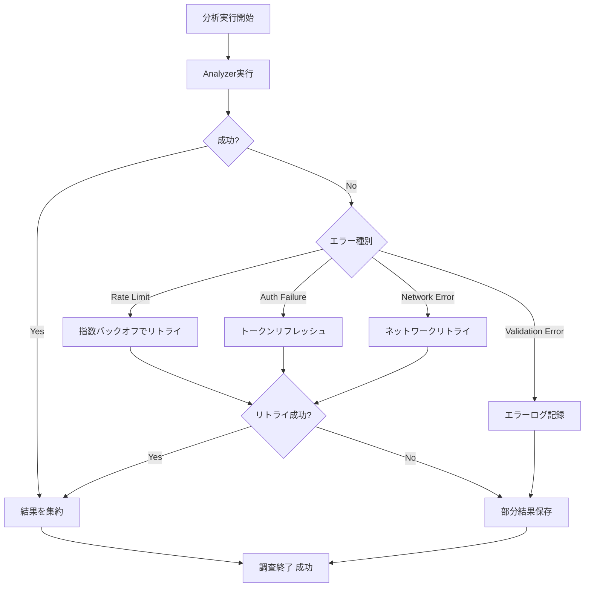

# Technical Design Document: Integration Feasibility Study

## Overview

**Purpose**: 外部システムまたはサービスとの連携機能の技術的実現可能性を体系的に調査・検証するシステムを提供します。本システムは、連携方式の評価、パフォーマンステスト、セキュリティ評価、コスト試算、リスク分析、ドキュメント生成の機能を統合し、実装判断に必要な包括的な情報を収集します。

**Users**: 開発チーム、セキュリティ担当者、プロジェクトマネージャー、ステークホルダーが利用し、API連携の技術評価、性能検証、セキュリティリスク評価、コスト見積もり、意思決定のワークフローで活用されます。

**Impact**: 新規プロジェクトとして、連携技術の選定プロセスを標準化し、調査品質の向上、評価時間の短縮、リスクの早期発見を実現します。

### Goals

- REST、GraphQL、WebHook等の複数連携方式を統一的に評価し、比較可能な形式で結果を出力
- パフォーマンス（レスポンスタイム、スループット、同時接続数）を実測しボトルネックを特定
- セキュリティ脆弱性（認証、暗号化、コンプライアンス）を評価しリスクを明確化
- コスト試算（ライセンス、運用、開発工数）とROI計算により予算計画を支援
- 技術的制約とリスクを明示し、設計段階での軽減策を提案
- 構造化されたレポート（OpenAPI仕様 + Markdownレポート）を自動生成

### Non-Goals

- 実際の連携機能の実装（本システムは調査・評価に特化）
- 継続的なモニタリング・運用監視（デプロイ後の監視は対象外）
- 特定ベンダー製品への依存（オープンソース・標準技術を優先）
- UIダッシュボードの提供（CLIベースの実行とレポート生成に集中）

## Architecture

> 詳細な調査ノートは`research.md`を参照。設計判断と契約はここに記載し、レビュー者が自己完結的に理解できるようにします。

### Architecture Pattern & Boundary Map

**Selected Pattern**: Modular Pipeline Architecture + Plugin-based Extensibility

**Architecture Integration**:
- **パターン選択理由**: 7つの独立した要件領域（連携方式評価、パフォーマンス、セキュリティ、エラーハンドリング、コスト、リスク、ドキュメント）がモジュール境界と自然に対応。将来的な拡張（新連携方式、新分析手法）が容易。
- **ドメイン/機能境界**:
  - **Orchestration Domain**: 調査ワークフローの制御と実行順序管理
  - **Connectivity Domain**: 外部API/サービスへの接続、認証、レート制限管理
  - **Analysis Domain**: パフォーマンス計測、セキュリティスキャン、コスト計算
  - **Reporting Domain**: 調査結果の構造化、フォーマット変換、出力生成
- **新コンポーネント追加の根拠**:
  - **Pipeline Orchestrator**: 複数モジュールの実行順序制御と依存関係解決
  - **Connector Module**: 外部システムとの通信を抽象化し、認証・リトライロジックを集約
  - **Analyzer Plugins**: 各評価領域（性能、セキュリティ、コスト）を独立したプラグインとして実装
  - **Report Generator**: OpenAPI仕様とMarkdownレポートの生成を担当



### Technology Stack

| Layer | Choice / Version | Role in Feature | Notes |
|-------|------------------|-----------------|-------|
| CLI | Commander.js v12.x | コマンドライン引数解析、サブコマンド管理 | TypeScript型定義サポート、豊富なオプション |
| Backend / Services | TypeScript 5.x + Node.js 20.x LTS | 型安全なモジュール実装、非同期処理 | async/await、強い型付け、豊富なエコシステム |
| HTTP Client | Axios v1.x | 外部API呼び出し、インターセプター、リトライ | Promise対応、レスポンス変換、エラーハンドリング |
| Performance Testing | JMeter (子プロセス実行) | 負荷テスト、スループット計測 | 業界標準、複数プロトコル対応 |
| Security Testing | OWASP ZAP API v2.x | 脆弱性スキャン、セキュリティ評価 | オープンソース、CI/CD統合可能 |
| Documentation | openapi-typescript v6.x | OpenAPI 3.1.x仕様生成 | 型定義自動生成、Swagger UI連携 |
| Testing | Vitest v1.x | ユニット・統合テスト | 高速実行、TypeScript対応、Jest互換 |
| Data Storage | JSON Files (ローカルファイルシステム) | 調査結果の永続化 | シンプル、人間可読、バージョン管理可能 |

**Rationale**: TypeScriptは設計原則「Type Safety is Mandatory」に完全準拠。Node.jsエコシステムはREST/GraphQL統合に最適。外部ツール（JMeter、ZAP）は業界標準で信頼性が高く、子プロセス実行により本体との疎結合を維持。詳細な比較・ベンチマークは`research.md`参照。

## System Flows

### 調査実行フロー



**Key Decisions**:
- パフォーマンス、セキュリティ、コストの分析は並列実行可能（依存関係なし）
- 認証は最初に一度だけ実行し、全モジュールで再利用
- エラー発生時は部分的な結果を保存し、失敗したモジュールのみ再実行可能

### エラーハンドリングフロー



**Gating Conditions**: レート制限エラーは最大3回リトライ（1s、2s、4sの指数バックオフ）。認証エラーはトークンリフレッシュを1回試行。ネットワークエラーは5回までリトライ。検証エラーはリトライせず即座にログ記録し次のアナライザへ。

## Requirements Traceability

| Requirement | Summary | Components | Interfaces | Flows |
|-------------|---------|------------|------------|-------|
| 1 | 連携方式の技術調査 | Connector Module, Integration Evaluator | ConnectorService, EvaluationReport | 調査実行フロー |
| 2 | パフォーマンス要件の検証 | Performance Analyzer, JMeter Bridge | PerformanceTestService, MetricsReport | 調査実行フロー (並列実行) |
| 3 | セキュリティ要件の評価 | Security Analyzer, ZAP Bridge | SecurityScanService, VulnerabilityReport | 調査実行フロー (並列実行) |
| 4 | エラーハンドリングと可用性の検証 | Error Handler, Retry Logic | ErrorHandlingService | エラーハンドリングフロー |
| 5 | コスト試算とリソース要件 | Cost Analyzer, ROI Calculator | CostEstimationService, ROIReport | 調査実行フロー (並列実行) |
| 6 | 技術的制約とリスクの明確化 | Risk Analyzer, Compatibility Checker | RiskAssessmentService, ConstraintReport | 調査実行フロー |
| 7 | 調査結果のドキュメント化 | Report Generator, OpenAPI Generator, Markdown Generator | ReportGenerationService | 調査実行フロー (最終ステップ) |

## Components and Interfaces

| Component | Domain/Layer | Intent | Req Coverage | Key Dependencies (P0/P1) | Contracts |
|-----------|--------------|--------|--------------|--------------------------|-----------|
| Pipeline Orchestrator | Orchestration | 調査ワークフローの制御と実行順序管理 | All | Config Loader (P0), All Analyzers (P0) | Service, State |
| Connector Module | Connectivity | 外部API/サービスへの接続と認証 | 1, 4 | Auth Manager (P0), Rate Limiter (P0) | Service, API |
| Performance Analyzer | Analysis | パフォーマンステスト実行と計測 | 2 | JMeter Bridge (P0), Connector (P0) | Service, Batch |
| Security Analyzer | Analysis | セキュリティ脆弱性スキャン | 3 | ZAP Bridge (P0), Connector (P0) | Service, Batch |
| Cost Analyzer | Analysis | コスト試算とROI計算 | 5 | Pricing DB (P1) | Service |
| Risk Analyzer | Analysis | 技術的制約とリスク評価 | 6 | Compatibility DB (P1) | Service |
| Report Generator | Reporting | OpenAPI仕様とMarkdown生成 | 7 | Data Aggregator (P0), Template Engine (P1) | Service, API |

### Orchestration Domain

#### Pipeline Orchestrator

| Field | Detail |
|-------|--------|
| Intent | 調査パイプライン全体を制御し、各Analyzerの実行順序と依存関係を管理する |
| Requirements | 1, 2, 3, 4, 5, 6, 7 |

**Responsibilities & Constraints**
- 調査設定の読み込みとバリデーション
- Analyzerの実行順序制御（並列実行可能な場合は並列化）
- エラーハンドリングと部分的な結果の保存
- 調査プロセスの進捗管理とログ出力

**Dependencies**
- Inbound: CLI Interface — コマンド実行の受付 (P0)
- Outbound: All Analyzer Services — 分析タスクの実行委譲 (P0)
- Outbound: Report Generator — 最終レポート生成 (P0)
- External: Config file (YAML/JSON) — 調査設定の読み込み (P0)

**Contracts**: [x] Service [ ] API [ ] Event [ ] Batch [x] State

##### Service Interface

```typescript
interface PipelineOrchestratorService {
  /**
   * Execute the full study pipeline
   * @param config - Study configuration including target URL, auth, analyzers to run
   * @returns Study result with reports and partial results if any failures
   */
  executeStudy(config: StudyConfig): Promise<Result<StudyResult, StudyError>>;

  /**
   * Resume a previously failed study from checkpoint
   * @param checkpointId - ID of the saved checkpoint
   * @returns Study result continuing from checkpoint
   */
  resumeStudy(checkpointId: string): Promise<Result<StudyResult, StudyError>>;
}

interface StudyConfig {
  readonly target: TargetConfig;
  readonly analyzers: AnalyzerConfig[];
  readonly reportFormats: ReportFormat[];
  readonly parallelExecution: boolean;
}

interface StudyResult {
  readonly success: boolean;
  readonly reports: Report[];
  readonly partialResults: AnalyzerResult[];
  readonly errors: StudyError[];
}

type StudyError =
  | { type: 'CONFIG_INVALID'; message: string; field: string }
  | { type: 'ANALYZER_FAILED'; analyzer: string; cause: Error }
  | { type: 'REPORT_GENERATION_FAILED'; cause: Error };
```

**Preconditions**:
- StudyConfigが有効なスキーマに準拠
- 指定されたAnalyzerが全て利用可能

**Postconditions**:
- 成功時: 全レポートが生成され、ファイルシステムに保存
- 失敗時: 部分的な結果がチェックポイントとして保存され、再実行可能

**Invariants**:
- Analyzerは指定された順序で実行（parallelExecution=falseの場合）
- エラー発生時も実行済みの結果は保持

##### State Management

**State Model**:
- `StudyState` = `INITIALIZED` | `RUNNING` | `PAUSED` | `COMPLETED` | `FAILED`
- 各Analyzerの状態: `PENDING` | `IN_PROGRESS` | `COMPLETED` | `FAILED`

**Persistence**:
- チェックポイントはJSON形式でローカルファイルに保存 (`.study-checkpoint/{study-id}.json`)
- 再実行時は最後の成功状態から再開

**Concurrency Strategy**:
- parallelExecution=trueの場合、独立したAnalyzerをPromise.allで並列実行
- 共有リソース（Connector）へのアクセスはMutexで排他制御

**Implementation Notes**
- Integration: CLI InterfaceからCommanderパターンで呼び出し
- Validation: 設定ファイルはJSON Schemaで事前検証
- Risks: 長時間実行の中断リスク → チェックポイント機能で軽減

### Connectivity Domain

#### Connector Module

| Field | Detail |
|-------|--------|
| Intent | 外部API/サービスへの接続、認証、レート制限管理を抽象化 |
| Requirements | 1, 4 |

**Responsibilities & Constraints**
- REST、GraphQL、WebHookエンドポイントへの統一的なHTTPクライアント提供
- OAuth2.0、API Key、JWT等の認証方式のサポート
- レート制限の検出と自動リトライ
- 接続タイムアウトとサーキットブレーカーパターンの実装

**Dependencies**
- Inbound: All Analyzers — HTTP通信の実行依頼 (P0)
- Outbound: Auth Manager — 認証トークンの取得・リフレッシュ (P0)
- Outbound: Rate Limiter — レート制限チェック (P0)
- External: Axios — HTTPリクエスト実行 (P0)

**Contracts**: [x] Service [x] API [ ] Event [ ] Batch [ ] State

##### Service Interface

```typescript
interface ConnectorService {
  /**
   * Send HTTP request to target API
   * @param request - HTTP request configuration
   * @returns HTTP response or error
   */
  sendRequest<T>(request: HttpRequest): Promise<Result<HttpResponse<T>, HttpError>>;

  /**
   * Test connection to target API
   * @param target - Target API configuration
   * @returns Connection test result with latency
   */
  testConnection(target: TargetConfig): Promise<Result<ConnectionTestResult, HttpError>>;
}

interface HttpRequest {
  readonly method: 'GET' | 'POST' | 'PUT' | 'DELETE' | 'PATCH';
  readonly url: string;
  readonly headers?: Record<string, string>;
  readonly body?: unknown;
  readonly timeout?: number;
}

interface HttpResponse<T> {
  readonly status: number;
  readonly headers: Record<string, string>;
  readonly data: T;
  readonly latency: number;
}

type HttpError =
  | { type: 'RATE_LIMIT_EXCEEDED'; retryAfter: number }
  | { type: 'AUTH_FAILED'; reason: string }
  | { type: 'TIMEOUT'; duration: number }
  | { type: 'NETWORK_ERROR'; cause: Error }
  | { type: 'VALIDATION_ERROR'; message: string };
```

**Preconditions**:
- 認証情報が設定済み（AuthManager経由）
- ターゲットURLが有効なHTTP(S)エンドポイント

**Postconditions**:
- レート制限検出時は自動的にリトライスケジュール
- 認証失敗時はAuthManagerにトークンリフレッシュを要求

**Invariants**:
- 全てのHTTPリクエストにUser-Agentヘッダーを付与
- タイムアウトはデフォルト30秒、設定で変更可能

##### API Contract

| Method | Endpoint | Request | Response | Errors |
|--------|----------|---------|----------|--------|
| POST | /api/connector/request | HttpRequest | HttpResponse<T> | 429, 401, 408, 500 |
| GET | /api/connector/test | TargetConfig | ConnectionTestResult | 401, 408, 500 |

**Implementation Notes**
- Integration: Axiosインスタンスにインターセプターを登録し、レート制限・認証エラーを自動ハンドリング
- Validation: リクエストURLのスキーマ検証（http/httpsのみ許可）
- Risks: 外部サービスの不安定性 → サーキットブレーカーで連続失敗時に一時停止

### Analysis Domain

#### Performance Analyzer

| Field | Detail |
|-------|--------|
| Intent | パフォーマンステストを実行し、レスポンスタイム・スループット・同時接続数を計測 |
| Requirements | 2 |

**Responsibilities & Constraints**
- JMeterを子プロセスで実行し、負荷テストを実施
- レスポンスタイム（平均、最大、最小、パーセンタイル）の計測
- スループット（RPS: Requests Per Second）の計測
- 同時接続数を段階的に増加させボトルネックを特定

**Dependencies**
- Inbound: Pipeline Orchestrator — テスト実行の指示 (P0)
- Outbound: Connector Module — ターゲットAPIへのアクセス (P0)
- External: JMeter CLI — 負荷テスト実行エンジン (P0)

**Contracts**: [x] Service [ ] API [ ] Event [x] Batch [ ] State

##### Service Interface

```typescript
interface PerformanceAnalyzerService {
  /**
   * Run performance test against target API
   * @param config - Performance test configuration
   * @returns Performance metrics and bottleneck analysis
   */
  runPerformanceTest(config: PerformanceTestConfig): Promise<Result<PerformanceMetrics, TestError>>;
}

interface PerformanceTestConfig {
  readonly target: TargetConfig;
  readonly concurrency: number[];  // [1, 10, 50, 100]
  readonly duration: number;  // seconds
  readonly rampUp: number;  // seconds
}

interface PerformanceMetrics {
  readonly responseTime: {
    readonly mean: number;
    readonly min: number;
    readonly max: number;
    readonly p50: number;
    readonly p95: number;
    readonly p99: number;
  };
  readonly throughput: number;  // requests per second
  readonly errorRate: number;  // percentage
  readonly concurrencyResults: ConcurrencyResult[];
}

interface ConcurrencyResult {
  readonly concurrency: number;
  readonly successRate: number;
  readonly avgLatency: number;
}

type TestError =
  | { type: 'JMETER_NOT_FOUND'; message: string }
  | { type: 'TEST_TIMEOUT'; duration: number }
  | { type: 'TARGET_UNREACHABLE'; cause: Error };
```

##### Batch / Job Contract

**Trigger**: Pipeline Orchestrator からの明示的な実行指示

**Input / Validation**:
- PerformanceTestConfigのスキーマ検証
- JMeterの実行可能性チェック（`jmeter --version`の実行）
- ターゲットAPIの到達性確認

**Output / Destination**:
- PerformanceMetrics JSON（ローカルファイル: `.study-results/performance/{study-id}.json`）
- JMeterログファイル（デバッグ用）

**Idempotency & Recovery**:
- 同じconfigで再実行すると同一条件でテストを実施
- 中断時は部分結果を保存し、次回は未実施の同時接続数レベルから再開

**Implementation Notes**
- Integration: JMeterをchild_processで実行、結果はJTLファイルを解析してJSON変換
- Validation: 同時接続数が1以上、durationが10秒以上であることを確認
- Risks: ターゲットサービスへの過負荷 → 事前警告とオプトインフラグ（--enable-load-test）を必須化

#### Security Analyzer

| Field | Detail |
|-------|--------|
| Intent | OWASP ZAPを利用してセキュリティ脆弱性をスキャン |
| Requirements | 3 |

**Responsibilities & Constraints**
- OWASP ZAP APIを経由して脆弱性スキャンを実行
- TLS設定、認証方式、暗号化方式の検証
- OWASP Top 10脆弱性の検出
- 誤検知（False Positive）の可能性を明示

**Dependencies**
- Inbound: Pipeline Orchestrator — スキャン実行の指示 (P0)
- Outbound: Connector Module — ターゲットAPIへのアクセス (P0)
- External: OWASP ZAP API — 脆弱性スキャンエンジン (P0)

**Contracts**: [x] Service [ ] API [ ] Event [x] Batch [ ] State

##### Service Interface

```typescript
interface SecurityAnalyzerService {
  /**
   * Run security vulnerability scan
   * @param config - Security scan configuration
   * @returns Vulnerability report with severity classification
   */
  runSecurityScan(config: SecurityScanConfig): Promise<Result<VulnerabilityReport, ScanError>>;
}

interface SecurityScanConfig {
  readonly target: TargetConfig;
  readonly scanType: 'passive' | 'active';  // passive=non-intrusive, active=intrusive
  readonly complianceChecks: ('GDPR' | 'PCI-DSS' | 'HIPAA')[];
}

interface VulnerabilityReport {
  readonly tlsVersion: string;
  readonly authMethods: AuthMethod[];
  readonly vulnerabilities: Vulnerability[];
  readonly complianceStatus: Record<string, boolean>;
}

interface Vulnerability {
  readonly id: string;
  readonly name: string;
  readonly severity: 'Critical' | 'High' | 'Medium' | 'Low' | 'Info';
  readonly description: string;
  readonly recommendation: string;
  readonly falsePositiveRisk: 'High' | 'Medium' | 'Low';
}

type ScanError =
  | { type: 'ZAP_NOT_RUNNING'; message: string }
  | { type: 'SCAN_TIMEOUT'; duration: number }
  | { type: 'TARGET_UNREACHABLE'; cause: Error };
```

##### Batch / Job Contract

**Trigger**: Pipeline Orchestrator からの明示的な実行指示

**Input / Validation**:
- SecurityScanConfigのスキーマ検証
- ZAP APIの到達性確認（`/JSON/core/view/version/` エンドポイント）
- ターゲットAPIの到達性確認

**Output / Destination**:
- VulnerabilityReport JSON（ローカルファイル: `.study-results/security/{study-id}.json`）
- ZAPレポート（HTML形式、詳細ログ）

**Idempotency & Recovery**:
- 同じconfigで再実行すると同一条件でスキャン実施
- 中断時は部分結果を保存し、次回は未スキャンのエンドポイントから再開

**Implementation Notes**
- Integration: ZAP API（Python zapv2ライブラリ）をNode.jsから呼び出し（child_processまたはHTTP API直接呼び出し）
- Validation: スキャンタイプがactiveの場合、明示的な確認プロンプトを表示
- Risks: 誤検知率が高い → 複数ツール併用（将来拡張）、手動レビューフローの推奨

#### Cost Analyzer

| Field | Detail |
|-------|--------|
| Intent | コスト試算とROI計算を実施 |
| Requirements | 5 |

**Responsibilities & Constraints**
- 連携サービスの料金体系を調査（従量課金、月額固定、無料枠）
- 想定トラフィックに基づく月間コスト試算
- 開発工数（初期実装、テスト、運用保守）の見積もり
- ROI計算（Net Benefits / Total Costs × 100）

**Dependencies**
- Inbound: Pipeline Orchestrator — コスト試算の指示 (P0)
- External: Pricing Database (JSON/YAML) — サービス料金情報 (P1)

**Contracts**: [x] Service [ ] API [ ] Event [ ] Batch [ ] State

##### Service Interface

```typescript
interface CostAnalyzerService {
  /**
   * Calculate cost estimation and ROI
   * @param config - Cost analysis configuration
   * @returns Cost estimation report with ROI
   */
  calculateCost(config: CostAnalysisConfig): Promise<Result<CostEstimationReport, AnalysisError>>;
}

interface CostAnalysisConfig {
  readonly service: string;  // e.g., "AWS Lambda", "Stripe API"
  readonly expectedTraffic: {
    readonly requestsPerMonth: number;
    readonly dataTransferGB: number;
  };
  readonly implementation: {
    readonly initialDevelopmentHours: number;
    readonly hourlyRate: number;
  };
}

interface CostEstimationReport {
  readonly directCosts: {
    readonly licensing: number;
    readonly usage: number;
    readonly infrastructure: number;
  };
  readonly indirectCosts: {
    readonly maintenance: number;
    readonly support: number;
  };
  readonly totalCosts: number;
  readonly roi: number;  // percentage
  readonly breakdown: CostBreakdown[];
}

interface CostBreakdown {
  readonly category: string;
  readonly amount: number;
  readonly unit: string;
}

type AnalysisError =
  | { type: 'PRICING_DATA_NOT_FOUND'; service: string }
  | { type: 'INVALID_TRAFFIC_ESTIMATE'; message: string };
```

**Preconditions**:
- Pricing Databaseに対象サービスの料金情報が存在
- トラフィック見積もりが正の整数

**Postconditions**:
- コスト内訳が全てのカテゴリ（直接・間接）で算出
- ROIが計算式に基づき正確に算出

**Invariants**:
- Total Costs = Direct Costs + Indirect Costs
- ROI = ((Expected Benefits - Total Costs) / Total Costs) × 100

**Implementation Notes**
- Integration: Pricing DatabaseはJSON/YAML形式でローカルに配置、将来的に外部APIとの統合も検討
- Validation: トラフィック見積もりの上限チェック（現実的な範囲を超える値は警告）
- Risks: 料金体系の変更 → 定期的なPricing Database更新の推奨、更新日時をレポートに記載

#### Risk Analyzer

| Field | Detail |
|-------|--------|
| Intent | 技術的制約とリスクを評価 |
| Requirements | 6 |

**Responsibilities & Constraints**
- 既存システムとの互換性チェック（言語、フレームワーク、ライブラリバージョン）
- ベンダーロックインリスクの評価
- 拡張性・スケーラビリティの検証
- 学習コストと採用リスクの評価

**Dependencies**
- Inbound: Pipeline Orchestrator — リスク評価の指示 (P0)
- External: Compatibility Database (JSON) — 互換性情報 (P1)

**Contracts**: [x] Service [ ] API [ ] Event [ ] Batch [ ] State

##### Service Interface

```typescript
interface RiskAnalyzerService {
  /**
   * Analyze technical constraints and risks
   * @param config - Risk analysis configuration
   * @returns Risk assessment report with mitigation strategies
   */
  analyzeRisks(config: RiskAnalysisConfig): Promise<Result<RiskAssessmentReport, AnalysisError>>;
}

interface RiskAnalysisConfig {
  readonly existingStack: {
    readonly language: string;
    readonly frameworks: string[];
    readonly libraries: Record<string, string>;  // name -> version
  };
  readonly targetIntegration: {
    readonly service: string;
    readonly requiredDependencies: string[];
  };
}

interface RiskAssessmentReport {
  readonly compatibility: CompatibilityResult;
  readonly vendorLockIn: VendorLockInRisk;
  readonly scalability: ScalabilityAssessment;
  readonly learningCurve: LearningCurveRisk;
  readonly mitigations: Mitigation[];
}

interface CompatibilityResult {
  readonly compatible: boolean;
  readonly conflicts: Conflict[];
  readonly requiredUpgrades: Upgrade[];
}

interface Conflict {
  readonly component: string;
  readonly current: string;
  readonly required: string;
  readonly severity: 'Blocking' | 'High' | 'Medium' | 'Low';
}

interface Mitigation {
  readonly risk: string;
  readonly strategy: string;
  readonly effort: 'High' | 'Medium' | 'Low';
}
```

**Preconditions**:
- 既存スタック情報が正確に提供される
- Compatibility Databaseに対象サービスの依存関係情報が存在

**Postconditions**:
- 全ての互換性問題が検出され、重要度が付与
- リスクごとに軽減策が提案

**Invariants**:
- ブロッキングレベルの競合が1つでも存在する場合、compatible=false

**Implementation Notes**
- Integration: Compatibility Databaseはsemverパッケージで互換性判定
- Validation: バージョン番号のフォーマット検証（semantic versioning準拠）
- Risks: 互換性データベースの不完全性 → コミュニティ貢献の推奨、手動確認フローの提供

### Reporting Domain

#### Report Generator

| Field | Detail |
|-------|--------|
| Intent | 調査結果を構造化されたレポート形式（OpenAPI + Markdown）で出力 |
| Requirements | 7 |

**Responsibilities & Constraints**
- 全Analyzerの結果を集約
- OpenAPI 3.1.x仕様の生成（API評価結果を記述）
- Markdownレポートの生成（全体サマリー、比較表、推奨事項）
- テンプレートエンジンによる柔軟なフォーマット対応

**Dependencies**
- Inbound: Pipeline Orchestrator — レポート生成の指示 (P0)
- Outbound: Data Aggregator — 結果の集約 (P0)
- External: openapi-typescript — OpenAPI仕様生成 (P0)
- External: Handlebars — Markdownテンプレートレンダリング (P1)

**Contracts**: [x] Service [x] API [ ] Event [ ] Batch [ ] State

##### Service Interface

```typescript
interface ReportGeneratorService {
  /**
   * Generate OpenAPI specification and Markdown report
   * @param studyResult - Aggregated study results from all analyzers
   * @returns Generated reports with file paths
   */
  generateReports(studyResult: StudyResult): Promise<Result<GeneratedReports, ReportError>>;
}

interface GeneratedReports {
  readonly openApiSpec: {
    readonly path: string;
    readonly content: OpenAPISpec;
  };
  readonly markdownReport: {
    readonly path: string;
    readonly content: string;
  };
}

interface OpenAPISpec {
  readonly openapi: '3.1.0';
  readonly info: {
    readonly title: string;
    readonly version: string;
    readonly description: string;
  };
  readonly servers: Server[];
  readonly paths: Record<string, PathItem>;
}

type ReportError =
  | { type: 'TEMPLATE_NOT_FOUND'; templateName: string }
  | { type: 'GENERATION_FAILED'; cause: Error };
```

##### API Contract

| Method | Endpoint | Request | Response | Errors |
|--------|----------|---------|----------|--------|
| POST | /api/reports/generate | StudyResult | GeneratedReports | 404, 500 |

**Preconditions**:
- StudyResultに少なくとも1つのAnalyzer結果が含まれる
- テンプレートファイルが存在（templates/openapi.hbs、templates/markdown.hbs）

**Postconditions**:
- OpenAPI仕様ファイルが`.study-results/reports/{study-id}.openapi.json`に保存
- Markdownレポートが`.study-results/reports/{study-id}.md`に保存

**Invariants**:
- 生成されたOpenAPI仕様はOpenAPI 3.1.xスキーマに準拠
- Markdownレポートは必ずExecutive Summary、比較表、推奨事項を含む

**Implementation Notes**
- Integration: openapi-typescriptでスキーマ生成後、Handlebarsでテンプレートレンダリング
- Validation: 生成されたOpenAPI仕様をvalidatorでスキーマ検証
- Risks: テンプレート破損 → デフォルトテンプレートをバイナリに埋め込み、フォールバック機能を提供

## Data Models

### Domain Model

**Aggregates**:
- **Study Aggregate**: 1つの調査セッションを表す。root entity。
  - Entities: Study (root), AnalyzerResult, Report
  - Value Objects: TargetConfig, StudyConfig, Metrics
  - Domain Events: StudyStarted, AnalyzerCompleted, StudyCompleted, StudyFailed

**Transactional Boundaries**:
- Studyは単一のトランザクション境界。1つのStudy内の全AnalyzerResultは一貫性を保持。
- 各AnalyzerResultは独立して永続化可能（部分保存のため）。

**Business Rules & Invariants**:
- Studyは最低1つのAnalyzerを含む必要がある
- AnalyzerResultのstatusがFAILEDの場合、StudyのstatusもFAILED（部分成功を許容）
- Reportは全てのAnalyzerResult完了後のみ生成可能

### Logical Data Model

**Structure Definition**:

```typescript
// Study Entity (Root)
interface Study {
  readonly id: string;  // UUID
  readonly createdAt: Date;
  readonly updatedAt: Date;
  readonly status: StudyStatus;
  readonly config: StudyConfig;
  readonly results: AnalyzerResult[];
  readonly reports: Report[];
}

type StudyStatus = 'INITIALIZED' | 'RUNNING' | 'COMPLETED' | 'FAILED';

// Analyzer Result Entity
interface AnalyzerResult {
  readonly id: string;  // UUID
  readonly studyId: string;  // Foreign key to Study
  readonly analyzerType: AnalyzerType;
  readonly status: AnalyzerStatus;
  readonly startedAt: Date;
  readonly completedAt?: Date;
  readonly data: unknown;  // Type depends on analyzer (PerformanceMetrics | VulnerabilityReport | ...)
  readonly errors: Error[];
}

type AnalyzerType = 'PERFORMANCE' | 'SECURITY' | 'COST' | 'RISK';
type AnalyzerStatus = 'PENDING' | 'IN_PROGRESS' | 'COMPLETED' | 'FAILED';

// Report Entity
interface Report {
  readonly id: string;  // UUID
  readonly studyId: string;  // Foreign key to Study
  readonly format: ReportFormat;
  readonly filePath: string;
  readonly generatedAt: Date;
}

type ReportFormat = 'OPENAPI' | 'MARKDOWN' | 'JSON';
```

**Consistency & Integrity**:
- Study.id は UUID v4 で一意性保証
- AnalyzerResult.studyId は Study.id への参照整合性
- 1つのStudyに同じAnalyzerTypeのResultは1つのみ（複数回実行の場合は上書き）

**Temporal Aspects**:
- createdAt, updatedAt によるタイムスタンプ管理
- 監査ログは別途イベントソーシング形式で記録可能（将来拡張）

### Physical Data Model

**For JSON File Storage (Current Implementation)**:

**File Structure**:
```
.study-results/
  {study-id}/
    study.json          # Study entity
    analyzers/
      performance.json  # PerformanceMetrics
      security.json     # VulnerabilityReport
      cost.json         # CostEstimationReport
      risk.json         # RiskAssessmentReport
    reports/
      {study-id}.openapi.json
      {study-id}.md
    checkpoint.json     # For resume functionality
```

**Indexing**: ファイルシステムベースのため、`study-id`をディレクトリ名としてインデックス化

**Partitioning Strategy**: 日付ベースのパーティション（将来的に.study-results/YYYY-MM/へ移行を検討）

### Data Contracts & Integration

**API Data Transfer**:
- 全てのAPI RequestとResponseはTypeScriptインターフェースで定義
- Serialization: JSON（JSON.stringify/JSON.parse）
- Validation: Zod または JSON Schemaによるランタイム検証

**Event Schemas**:
- 現時点でイベント駆動は未採用
- 将来的にDomain Eventsを導入する場合、CloudEvents仕様に準拠

**Cross-Service Data Management**:
- 現時点で単一プロセス実行のため不要
- マイクロサービス化の際はSagaパターンを検討

## Error Handling

### Error Strategy

全てのエラーは型安全なResult型（`Result<T, E>`）で表現し、Railwayパターンにより伝播を制御します。

**Result型定義**:
```typescript
type Result<T, E> =
  | { success: true; value: T }
  | { success: false; error: E };
```

### Error Categories and Responses

**User Errors (4xx equivalent)**:
- Invalid Config → 設定ファイルのスキーマエラーをフィールド単位で表示、修正例を提示
- Missing Required Field → どのフィールドが不足しているか明示
- Invalid URL → URLフォーマットの説明と正しい例を表示

**System Errors (5xx equivalent)**:
- JMeter Not Found → インストール手順へのリンクを表示、環境変数PATHの確認を促す
- ZAP Not Running → ZAPの起動コマンドを提示
- File System Error → ディスク容量の確認、権限の確認を促す

**Business Logic Errors (422 equivalent)**:
- Rate Limit Exceeded → 指数バックオフでリトライ、リトライ間隔をログ出力
- Authentication Failed → 認証情報の再確認を促す、トークンリフレッシュを試行
- Target Unreachable → ネットワーク接続の確認、ファイアウォール設定の確認を促す

**Recovery Mechanisms**:
- Retry with Exponential Backoff: レート制限、一時的なネットワークエラー
- Circuit Breaker: 連続5回の失敗でサーキットオープン、30秒後に再試行
- Graceful Degradation: 一部のAnalyzerが失敗しても他のAnalyzerは継続実行
- Checkpoint & Resume: 長時間実行の中断時、チェックポイントから再開可能

### Monitoring

**Error Tracking**:
- 全てのエラーをJSONLフォーマットでログファイルに記録（`.study-logs/{study-id}.log`）
- エラーレベル: DEBUG, INFO, WARN, ERROR, FATAL

**Logging**:
- 構造化ログ（JSON形式）
- 各ログエントリに`timestamp`, `level`, `component`, `message`, `context`を含む
- ログローテーション: 10MB毎、最大10ファイル保持

**Health Monitoring**:
- 各Analyzerの実行時間を計測、異常に長い場合は警告
- メモリ使用量の監視（Node.js process.memoryUsage()）
- 外部サービス（JMeter、ZAP）のヘルスチェック（起動前に実行可能性を確認）

## Testing Strategy

### Unit Tests

- **ConnectorService**: HTTPリクエスト送信、レート制限検出、認証トークン付与の正常系・異常系
- **PerformanceAnalyzer**: JMeter実行結果の解析、パーセンタイル計算の精度検証
- **CostAnalyzer**: ROI計算式の正確性、直接・間接コスト集計の検証
- **ReportGenerator**: OpenAPI仕様生成の妥当性、Markdownテンプレートレンダリングの正常系

### Integration Tests

- **Pipeline Orchestrator → Analyzers**: 複数Analyzerの並列実行、エラー時の部分結果保存
- **Connector → Auth Manager**: OAuth2.0フロー、トークンリフレッシュ、認証失敗のリトライ
- **Analyzers → Report Generator**: 全Analyzerの結果を集約し、完全なレポートを生成
- **Error Handling Flow**: レート制限エラー発生時の指数バックオフリトライ検証
- **Checkpoint & Resume**: 調査中断後の再開機能、未実行Analyzerのみが再実行されることを検証

### E2E Tests (CLI)

- **Full Study Execution**: `study run --target https://api.example.com --config study.yaml`で全フローを実行
- **Partial Failure Scenario**: 1つのAnalyzerが失敗した場合、他のAnalyzerは継続し部分結果を保存
- **Resume from Checkpoint**: 中断した調査を`study resume --checkpoint {id}`で再開
- **Report Generation**: 生成されたOpenAPI仕様がSwagger UIで正しく表示されることを確認
- **Error Reporting**: 設定ミスの場合、明確なエラーメッセージと修正例が表示されることを確認

### Performance Tests

- **Large Payload Handling**: 大量のAnalyzer結果（1000件以上のAPI endpointを含むOpenAPI仕様）の処理時間
- **Concurrent Analyzer Execution**: 4つのAnalyzerを並列実行した場合の実行時間短縮効果
- **Memory Footprint**: 長時間実行時のメモリリーク検証（Valgrind または Node.js --inspect）
- **File I/O Performance**: チェックポイント保存・読み込みの性能（大規模な調査結果の場合）

## Security Considerations

### Threat Modeling

**主要な脅威**:
- **Credential Leakage**: 認証情報（API Key、OAuth2 Token）のログやレポートへの露出
- **Command Injection**: 外部プロセス（JMeter、ZAP）実行時のコマンドインジェクション
- **Path Traversal**: ユーザー指定のファイルパスによるディレクトリトラバーサル攻撃
- **Sensitive Data in Reports**: ターゲットAPIのレスポンスに含まれる個人情報がレポートに記載

**Security Controls**:
- 認証情報はメモリ内で管理し、ログやレポートに出力しない（マスキング処理）
- 外部プロセス実行時は引数をホワイトリスト検証、shellオプションを無効化
- ファイルパス検証により、許可されたディレクトリ外へのアクセスを禁止
- レポート生成時に個人情報検出（正規表現）し、マスキングまたは警告表示

### Authentication and Authorization

本システムは単一ユーザーのCLIツールであり、マルチユーザー認証は不要。ただし、外部APIへの認証は以下をサポート:
- OAuth2.0 (Authorization Code, Client Credentials)
- API Key (Header, Query Parameter)
- JWT (Bearer Token)

### Data Protection and Privacy

**転送時の暗号化**: 全てのHTTP通信はHTTPSを使用（TLS 1.2以上）

**保存時の暗号化**:
- 認証情報は環境変数またはKMS（AWS Secrets Manager、HashiCorp Vault等）から取得
- ローカルファイルに平文で保存しない

**個人情報保護**:
- GDPR対応の場合、レポートに個人情報（メールアドレス、IPアドレス等）が含まれる可能性を警告
- `--mask-sensitive-data`オプションで自動マスキング機能を提供

## Performance & Scalability

### Target Metrics

| Metric | Target | Measurement Strategy |
|--------|--------|---------------------|
| Full Study Execution Time | < 5 minutes (4 analyzers in parallel) | E2E test with timer |
| Performance Analyzer Latency | < 2 minutes (100 concurrent users, 60s duration) | JMeter execution time |
| Security Analyzer Latency | < 3 minutes (passive scan) | ZAP scan duration |
| Report Generation Time | < 10 seconds (1000 API endpoints) | Time from aggregation to file write |
| Memory Footprint | < 500 MB (peak usage) | Node.js process.memoryUsage() |

### Scaling Approaches

**Horizontal Scaling**:
- 現時点でシングルプロセス実行のため不要
- 将来的に大規模調査（1000+エンドポイント）が必要な場合、Analyzerを分散実行（Kubernetes Job）

**Vertical Scaling**:
- JMeterのヒープサイズを調整（`-Xmx4g`等）してスループット向上
- Node.jsの--max-old-space-sizeオプションでメモリ上限を拡張

### Caching Strategies

- **HTTP Response Cache**: 同一エンドポイントへの重複リクエストをキャッシュ（axios-cacheインターセプター）
- **Pricing Database Cache**: 料金情報をメモリにキャッシュし、複数回の読み込みを回避
- **Template Cache**: Handlebarsテンプレートをコンパイル後にキャッシュ

## Migration Strategy

本システムは新規プロジェクトであり、既存システムからのマイグレーションは不要。

将来的な拡張（例: JSONファイルストレージ → PostgreSQL移行）の場合、以下のフェーズを検討:

**Phase 1**: Read/Write Adapterパターンで抽象化
**Phase 2**: Dual Write（JSON + PostgreSQL）で検証
**Phase 3**: PostgreSQLをプライマリに切り替え、JSONは読み取り専用
**Phase 4**: JSONストレージ廃止

